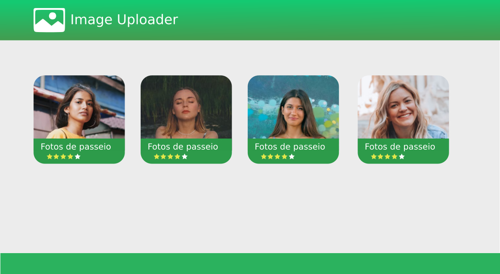
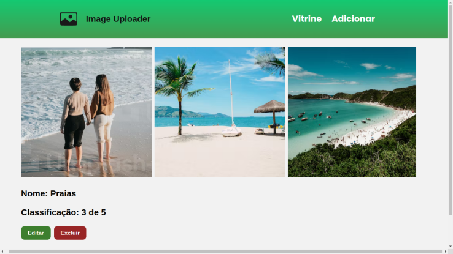

# Image Upload
project that saves the image in the database. Through this project it is possible to use the browser as an interface to save images in the database and show all the saved images.




Technologies Used

## Backend
* cors 
* **express**
* **mongoose**
* multer 
* nodemon

## Frontend
* **React.js**
* react-router-dom (React Router V6)
* yarn(vite)
* axios
* events

## installation mode
to start the project it is **necessary** to have installed _node.js, npm, yarn_ as a global installation

-> The project initialization must be done in the ./backend folder:

``` npm init -y ```

``` npm install cors express mongoose multer dotenv ```

``` npm install nodemon -D ```

-> after that, a ./frontend folder must be created with Yarn initialization with Vite:

``` yarn create-vite ```
**Note:** *this will ensure the environment variables and port are in the correct place*

1. choose react option
2. JavaScript
3. initialization with ```yarn```
3. start with ```yarn dev```

-> make an account in mongodb atlas and use the user and password in the .env file in the ./backend folder

## STEPS PROJECT:

- [x] Create connection with the bank.
- [x] Configure initial routes.
- [x] Configure multer.
- [x] Return endpoints from the API.
- [x] Create a CRUD function. 
- [x] Create home interface.
- [x] Create SPA routes.
- [x] Function add image.
- [x] Function Show other images.
- [x] Show details image of ID.
- [x] Image CRUD edit function.